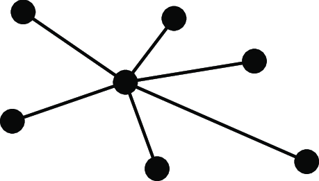
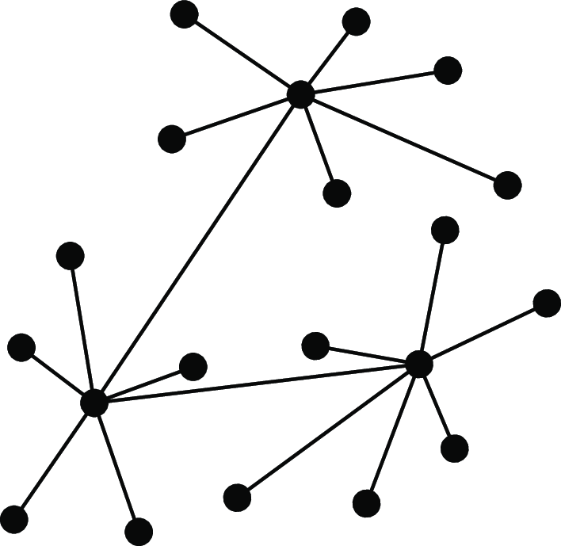
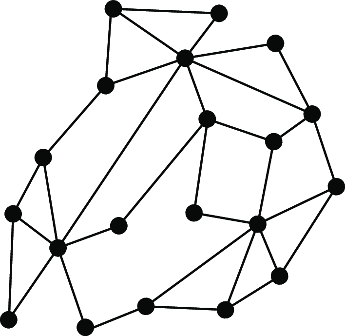

# Distributed_Systems

1. **Book:** [Distributed Systems, 4th Edition by van Steen and Tanenbaum](https://www.distributed-systems.net/index.php/books/ds4/)

2. **Technical Report:** [A View of Cloud Computing](https://www2.eecs.berkeley.edu/Pubs/TechRpts/2009/EECS-2009-28.html)

3. **Unix Shell Basics:** [Software Carpentry Unix Shell Tutorial](https://swcarpentry.github.io/shell-novice/aio.html)

4. **Videos:**
   - [Event-Driven Architectures Done Right, Apache Kafka • Tim Berglund • Devoxx Poland 2021](https://www.youtube.com/watch?v=A_mstzRGfIE)
   - [Distributed Systems in One Lesson by Tim Berglund](https://www.youtube.com/watch?v=Y6Ev8GIlbxc)
   - [Four Distributed Systems Architectural Patterns by Tim Berglund](https://www.youtube.com/watch?v=BO761Fj6HH8)
   - [The Many Meanings of Event-Driven Architecture • Martin Fowler](https://www.youtube.com/watch?v=STKCRSUsyP0)
  
   # [Here Are Notes from videos](https://github.com/showrin20/Distributed_Systems/tree/main/Tim%20Berglund)

| **Category**                  | **Details**                                                                                                                                                                                                                                                                                                                                                                                |
|-------------------------------|--------------------------------------------------------------------------------------------------------------------------------------------------------------------------------------------------------------------------------------------------------------------------------------------------------------------------------------------------------------------------------------------|
| **From Networked to Distributed Systems** | - **Centralized Systems**: Managed by a single node.   - **Decentralized Systems**: Distributed processes without full coordination.   - **Distributed Systems**: Processes sufficiently coordinated to operate as one.   - **Transition**: Adding links between nodes transforms decentralized systems into distributed ones. |
| **Alternative Approaches**    | - **Integrative View**: Combines existing systems into one.  - **Expansive View**: Extends systems with new nodes.   **Definitions**:   - **Decentralized System**: Processes necessarily distributed.   - **Distributed System**: Processes sufficiently distributed for coordination.                                                       |
| **Common Misconceptions**     | - **Centralized Systems**: Often scalable, e.g., DNS:   - Logically centralized, physically distributed.   - Robust designs reduce failure points.  - Misconceptions about scalability and security require systematic evaluation.                                                                                                                                               |
| **Perspectives on Systems**   | - **Architecture**: System organization.  - **Processes**: Types and interactions.   - **Communication**: Mechanisms for data exchange.   - **Coordination**: Independent algorithms.   - **Naming**: Resource identification.   - **Consistency & Replication**: Data uniformity.  - **Fault Tolerance**: Partial failure handling.   - **Security**: Authorized access. |
| **Design Goals**              | - **Resource Sharing**: Examples: Cloud storage, peer-to-peer streaming.  - **Distribution Transparency**: Hides distributed nature; types include Access, Location, Replication, and Concurrency transparency.  - **Openness**: Seamless integration via interfaces.   - **Dependability**: Reliability, Availability, Safety, Maintainability.  - **Scalability**: Size, geography, admin. |
| **Security**                  | - **Aspects**: Confidentiality, Integrity, Authentication, Authorization, Trust.   - **Mechanisms**:   - Symmetric encryption: Shared key.   - Asymmetric encryption: Public/private keys.   - Hashing: Data integrity verification.  - Digital signatures: Authenticity and origin validation.                                                                                |
| **Scalability Techniques**    | - **Latency Hiding**: Asynchronous communication.   - **Partitioning**: Distribute tasks across nodes.   - **Replication/Caching**: Store multiple data copies; challenge: consistency and synchronization.                                                                                                                                                                       |
| **System Classifications**    | - **High-Performance Computing**: Multiprocessor, multicore, grid systems.  - **Distributed Information Systems**: Middleware for integration (RPC, MOM).  - **Pervasive Systems**:   - Ubiquitous: Continuous user interaction.  - Mobile: Adapts to location changes.  - Sensor Networks: Collaborative environmental monitoring.                                      |
| **Pitfalls**                  | - **False Assumptions**:   - Network is reliable/secure.  - Topology is static.  - Zero latency/infinite bandwidth.  - Zero transport costs.  - Single administrator.                                                                                                                                                                                                      |

| **Category**         | **Centralized Systems**                                                                                                  | **Decentralized Systems**                                                                                                       | **Distributed Systems**                                                                                                       |
|-----------------------|-------------------------------------------------------------------------------------------------------------------------|--------------------------------------------------------------------------------------------------------------------------------|-----------------------------------------------------------------------------------------------------------------------------|
| **Short Notes**      | Single central node manages all processes and resources.                                                                | Resources/processes are spread across nodes but lack full coordination.                                                        | Processes/resources are distributed and coordinated to work as a cohesive system.                                           |
| **Broad Notes**      | Central control provides simplicity but creates bottlenecks and risks single points of failure.                          | Limited coordination among nodes; good for fault isolation but hard to achieve global consistency.                              | Balances coordination and independence across nodes; scalable and fault-tolerant but complex.                               |
| **Definition**       | A system where all components are controlled by a central point.                                                        | A network of nodes that operate independently, without global control.                                                         | A system where processes and resources are sufficiently distributed to enable global coordination and functionality.         |
| **Classification**   | Examples: Mainframes, single-server setups.                                                                             | Examples: Peer-to-peer networks, independent IoT systems.                                                                      | Examples: Cloud computing, microservices-based architectures.                                                               |
| **Example**          | DNS root server (logically centralized, physically distributed).                                                        | Early peer-to-peer file-sharing systems like Napster.                                                                          | Google Cloud Platform, Netflix architecture.                                                                                |
| **Alternatives**     | Decentralized or distributed systems when scalability or fault tolerance is needed.                                      | Centralized for simplicity or distributed for better coordination.                                                             | Decentralized for isolated systems or centralized for simpler needs.                                                        |
| **Comparison**       | Central control vs independence of nodes vs coordination across nodes.                                                  | Focuses on autonomy but sacrifices global functionality.                                                                       | Offers the best of both worlds but introduces complexity.                                                                   |
| **Advantage**        | Easy to manage and implement; robust when limited scalability is required.                                               | Fault isolation, less dependency on a single point, and local decision-making.                                                 | Scalability, reliability, fault tolerance, and efficient resource sharing.                                                  |
| **Disadvantage**     | Limited scalability; single point of failure; bottlenecks.                                                              | Poor global coordination; hard to scale with consistency.                                                                      | Increased complexity in implementation and maintenance.                                                                     |
| **Visualization**    |                              |  |  |
| **Architecture**     | Centralized control; single server or mainframe handles all processing and storage.                                      | Autonomous nodes interact independently with limited interconnection.                                                          | Peer-to-peer or client-server architecture; nodes operate both independently and collectively.                              |
| **Design**           | Simplistic design; focuses on a single central control node.                                                            | Moderate complexity; focuses on independent operation of nodes.                                                               | High complexity; requires synchronization, redundancy, and fault-tolerant mechanisms.                                       |
| **Scalability**      | Poor scalability; limited by the capacity of the central node.                                                          | Limited scalability due to coordination difficulties among independent nodes.                                                  | Excellent scalability; partitions workloads and scales horizontally.                                                        |
| **Reliability**      | Vulnerable to central point of failure; low fault tolerance.                                                            | Better reliability due to lack of dependency on a single node.                                                                | High reliability; handles partial failures without affecting the system as a whole.                                         |
| **Dependability**    | Depends entirely on the central node's performance and uptime.                                                          | Depends on the reliability of independent nodes; no global dependability.                                                      | Highly dependable with proper fault-tolerant and replication mechanisms.                                                    |
| **Fault Tolerance**  | Minimal fault tolerance; failure of the central node disrupts the entire system.                                        | Medium fault tolerance; some parts may fail without affecting others.                                                         | High fault tolerance; allows the system to continue functioning even with multiple node failures.                           |
| **Uses and Applications** | Banking systems, mainframe operations, small-scale enterprise systems.                                             | Peer-to-peer file sharing, localized IoT networks, small independent networks.                                                | Cloud computing (AWS, GCP), global databases, multimedia streaming (Netflix, YouTube), e-commerce platforms (Amazon).       |
  
