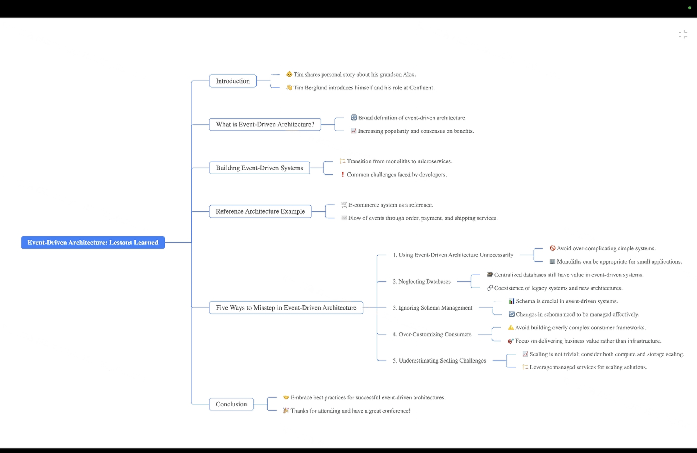
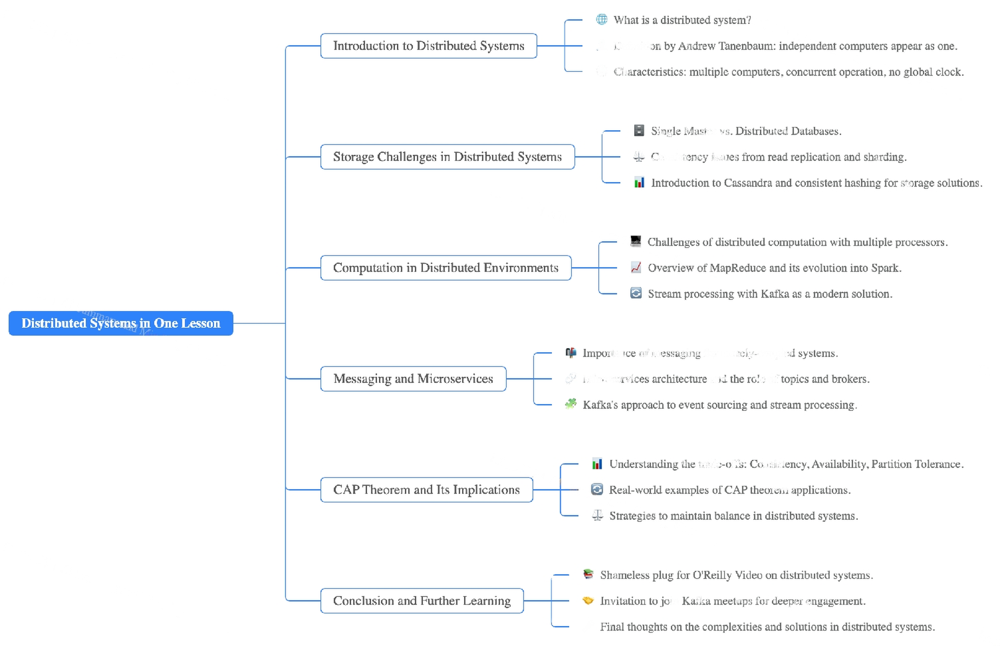

# [**Event-Driven Architecture: Best Practices, Pitfalls, and Lessons Learned**](https://www.youtube.com/watch?v=A_mstzRGfIE)

## **Introduction:**

### **Presenter:**  
- **Name:** Tim Berglund  
- **Role:** Developer Advocate Team Lead at Confluent  
- **Experience:** Specializes in Apache Kafka and event-driven systems.  
- **Event:** Devoxx Poland  
- **Background Context:**  
  - Tim shares insights gained from working with Apache Kafka and helping developers adopt Event-Driven Architecture (EDA) in real-world systems.  
  - This presentation is based on practical experience, lessons learned, and recurring patterns observed in the industry.  

## **Purpose of the Talk:**  
- To explore **Event-Driven Architecture (EDA):**
  - What it is and why it matters.  
  - Common mistakes developers make when implementing EDA.  
  - Practical lessons to ensure success with EDA systems.  

- The talk also touches on:  
  - When **not** to use EDA.  
  - Best practices for avoiding pitfalls.  

## **What is Event-Driven Architecture (EDA)?**

### **Definition:**  
EDA is a system design paradigm where software components communicate through **events** instead of direct calls or shared databases.  

### **Key Characteristics:**  
1. **Asynchronous Communication:**  
   - Components interact via event logs, avoiding synchronous dependencies.  
   - Improves scalability and fault tolerance.  

2. **Decoupled Microservices:**  
   - Each service handles its own logic and data, communicating indirectly through events.  
   - Reduces interdependencies and facilitates independent scaling.  

3. **Durable Logs:**  
   - A log acts as a **system of record**, capturing all events over time.  
   - Example: Kafka topics are durable logs that retain all events for reprocessing and analysis.  

### **Reference Example: An E-Commerce System**  
The architecture includes microservices for Orders, Users, Payments, and Shipping:  

- **Order Service:** Validates orders and writes them to an event log (e.g., Kafka topic).  
- **Payment Service:** Consumes events from the order log, processes payments, and writes payment status to another log.  
- **Shipping Service:** Listens to the payment log, fetches user details asynchronously, and fulfills orders.  

This structure enables asynchronous workflows, where each service processes events independently, ensuring scalability and resilience.  

## **Benefits of Event-Driven Architecture:**

1. **Scalability:**  
   - Each service can scale independently based on workload.  

2. **Resilience:**  
   - Asynchronous communication reduces the impact of failures in one service on others.  

3. **Flexibility:**  
   - Durable logs allow events to be replayed for debugging, reprocessing, or analytics.  

4. **Decentralized Data Ownership:**  
   - Services maintain local databases for their own use, ensuring data autonomy and reducing shared dependencies.  

## **Five Common Pitfalls in EDA and How to Avoid Them**

### **Pitfall 1: Using EDA When It's Not Needed**  
- **Problem:**  
  - Overcomplicating simple systems with unnecessary event-driven architecture.  

- **Solution:**  
  - Use a monolithic architecture for:  
    - Small systems with low complexity.  
    - Projects where requirements are unclear, or the system is expected to evolve.  

- **Key Insights:**  
  - "Monolith" doesn’t mean bad. It can be appropriate for small-scale systems.  
  - Avoid the temptation to break a small project into microservices unnecessarily.  

### **Pitfall 2: Avoiding Databases Entirely**  
- **Problem:**  
  - Misconception that event-driven systems eliminate the need for databases.  
  - Leads to overly complex state management within services.  

- **Solution:**  
  - Databases are still crucial for specific views and key lookups.  
  - Use tools like **Change Data Capture (CDC)** to synchronize traditional databases with event logs.  

- **Key Insights:**  
  - Event logs (e.g., Kafka topics) act as the **system of record**, but databases serve as **views** of that record.  
  - Avoid building distributed state management solutions yourself; use frameworks like **Kafka Streams** for this purpose.  

### **Pitfall 3: Neglecting Schema Management**  
- **Problem:**  
  - Poorly managed or inconsistent schemas can lead to compatibility issues and downstream failures.  

- **Solution:**  
  - Adopt tools like **Schema Registry** to manage schema evolution and versioning.  
  - Treat schema as a first-class concern to ensure compatibility between producers and consumers.  

- **Key Insights:**  
  - Schemas are essential for maintaining compatibility as systems evolve.  
  - Schema Registry ensures a smooth evolution of event formats without breaking consumers.  

### **Pitfall 4: Over-Customizing Consumers**  
- **Problem:**  
  - Writing custom code for consuming events can lead to unmanageable complexity.  

- **Solution:**  
  - Use frameworks like **Kafka Streams** or **KSQL DB** for handling aggregations, joins, and stateful operations.  

- **Key Insights:**  
  - Avoid over-engineering consumers with custom logic for state management.  
  - Let specialized tools handle the complexities of state and time management.  

### **Pitfall 5: Underestimating Scalability Challenges**  
- **Problem:**  
  - Failing to plan for scaling storage and compute independently.  

- **Solution:**  
  - Use **tiered storage** for cost-effective handling of historical data.  
  - Design systems to scale compute resources elastically based on demand.  

- **Key Insights:**  
  - Scaling compute and storage are distinct challenges that require separate solutions.  
  - Use managed services (e.g., **Confluent Cloud**) to simplify scaling operations.  

## **Practical Lessons for Successful EDA Implementation:**

1. **Durable Logs as System of Record:**  
   - Event logs capture the authoritative history of events.  
   - Databases are derived views of this log.  

2. **Distributed State Management:**  
   - Avoid custom solutions for state management.  
   - Use built-in frameworks like Kafka Streams for managing state across distributed systems.  

3. **Elastic Scalability:**  
   - Design systems to scale horizontally by adding more nodes.  
   - Use cloud storage (e.g., AWS S3) for older data to reduce costs.  

4. **Schema Evolution:**  
   - Ensure that schemas are versioned and compatible to support long-term system evolution.  

## **Best Practices:**

1. **Start Small:**  
   - Begin with simple architectures and evolve into EDA as complexity grows.  

2. **Embrace Managed Services:**  
   - Use cloud-based solutions (e.g., **Confluent Cloud**) to offload operational burdens.  

3. **Balance "Events" and "Things":**  
   - Prioritize "what happens" (events) but don’t neglect "what is" (state).  

4. **Adopt Tiered Storage:**  
   - Use low-cost storage solutions for older data while keeping recent data in high-performance systems.  

## **When to Avoid Event-Driven Architecture:**

1. **For Small, Simple Systems:**  
   - Low-complexity systems can work well with a single database and a monolithic design.  

2. **In High-Uncertainty Projects:**  
   - Avoid EDA when requirements are unclear; instead, build incrementally and iterate.  

## **Key Tools for EDA:**

1. **Kafka and Kafka Streams:** For event streaming and processing.  
2. **KSQL DB:** SQL-based interface for querying event streams.  
3. **Schema Registry:** For managing schema evolution and compatibility.  
4. **Change Data Capture (CDC):** For integrating traditional databases with event logs.  

## **Takeaways:**

- Event-Driven Architecture is a powerful design paradigm but not universally applicable.  
- Success lies in balancing simplicity, scalability, and schema management.  
- Managed services and existing tools can reduce complexity and operational burden.
  

# [**Distributed Systems in One Lesson: Overview and Insights**](https://www.youtube.com/watch?v=Y6Ev8GIlbxc)

Key Context:  
- Specializes in distributed systems, especially Apache Kafka.  
- Emphasizes the complexities and challenges of distributed systems while introducing open-source tools to solve them.  
- Goal: Convince developers to avoid unnecessary distributed systems but provide insights for those who must build them.

### **What is a Distributed System?**  
Definition by Andrew Tanenbaum: A collection of independent computers that appear as one system to the user.  
Characteristics:  
1. **Multiple Computers** operating concurrently.  
2. **Independent Failures** where any machine can fail without notice.  
3. **No Global Clock**, meaning systems do not share synchronized time.  

Examples:  
- Amazon.com  
- Cassandra Cluster  
- Kafka Cluster  

### **Core Challenges in Distributed Systems**  
1. **Storage**  
   - Scaling databases introduces complexity and sacrifices guarantees.  
   - Issues: Consistency, performance under load, and the need for sharding.  

2. **Computation**  
   - Moving from single-threaded computation to distributed processing is challenging.  
   - Tools like Hadoop, Spark, and Kafka Streams address these challenges.  

3. **Messaging**  
   - Facilitates communication between decoupled systems (e.g., microservices).  
   - Tools like Apache Kafka offer scalable solutions but require tradeoffs in ordering and consistency.

### **Key Topics Discussed**

#### **Storage in Distributed Systems**  
Single-server databases are simple but lack scalability.  

**Scaling Techniques**  
1. **Read Replication**:  
   - Copies data across servers for scalability.  
   - Breaks consistency as data may not propagate instantly (eventual consistency).  
2. **Sharding**:  
   - Divides data based on keys (e.g., usernames).  
   - Breaks the relational model, making joins impossible across shards.  
3. **Denormalization**:  
   - Sacrifices relational guarantees like joins to improve performance.  
   - Adds complexity to data modeling.  

**Cassandra’s Approach**  
1. Uses **consistent hashing** to evenly distribute data across nodes.  
2. Data is replicated across multiple nodes to tolerate failures.  
3. Consistency tradeoffs:  
   - Developers can tune read and write consistency levels (e.g., eventual vs. strong consistency).  
4. Example: If three replicas exist, reading two nodes and writing to two ensures strong consistency.  

**CAP Theorem**  
1. **Consistency**: Ensures data is up-to-date across all nodes.  
2. **Availability**: Guarantees the system is responsive.  
3. **Partition Tolerance**: Tolerates network failures.  
   - CAP Theorem states that systems can only guarantee two out of three.  
   - Example: Choose consistency or availability during a network partition.  

#### **Computation in Distributed Systems**  
Computation in single-threaded systems is easy but becomes difficult in distributed environments.  

**MapReduce Paradigm**  
1. Divides data into chunks and processes them in parallel (map step).  
2. Aggregates results to produce final output (reduce step).  
3. Works well for batch processing but lacks flexibility.  
4. Example: Hadoop uses MapReduce for distributed computation.  

**Spark’s Improvements**  
1. Introduced Resilient Distributed Datasets (RDDs) and DataFrames for developer-friendly APIs.  
2. Supports distributed computation on various data sources (HDFS, S3, Cassandra).  
3. Faster and more intuitive than Hadoop.  

**Kafka Streams**  
1. Focuses on **stream processing**, computing data in real time as it flows through the system.  
2. Complements batch processing tools like Spark by handling continuous data streams.  

#### **Messaging in Distributed Systems**  
Messaging enables communication between loosely coupled services, making it essential for microservices.  

**Traditional Message Queues**  
1. Single-server message brokers are simple but lack scalability and fault tolerance.  
2. Challenges:  
   - Single points of failure.  
   - Limited throughput due to server constraints.  

**Apache Kafka**  
1. **Partitioning**:  
   - Splits topics into partitions distributed across multiple servers.  
   - Guarantees ordering within partitions but not across them.  
2. **Replication**:  
   - Ensures fault tolerance by replicating partitions across nodes.  
3. **Elastic Scalability**:  
   - Can scale horizontally by adding brokers to the cluster.  
4. **Data Retention**:  
   - Allows configurable retention periods for stored messages.  

**Advantages of Kafka**  
1. **Stream Processing**:  
   - Enables real-time computation on data in motion.  
2. **Decoupling Services**:  
   - Events in Kafka topics can be consumed independently by multiple services.  
3. **Anti-Pattern Avoidance**:  
   - Reduces reliance on dual batch-stream processing systems (Lambda architecture).  

### **Key Insights and Best Practices**  

**When to Use Distributed Systems**  
1. Use distributed systems only when scale and fault tolerance are critical.  
2. Avoid unnecessary complexity for small-scale systems.  

**Storage**  
1. Plan for scaling by using replication and sharding.  
2. Accept tradeoffs in consistency and data modeling.  
3. Use distributed databases like Cassandra for predictable scaling behavior.  

**Computation**  
1. Leverage modern tools like Spark and Kafka Streams for distributed processing.  
2. Prefer real-time stream processing over batch processing when possible.  

**Messaging**  
1. Use message brokers like Kafka to decouple services and enable asynchronous communication.  
2. Design systems to tolerate eventual consistency and partitioning constraints.  

### **Conclusion**  
Distributed systems solve critical scalability and fault tolerance challenges but introduce complexity.  
Adopt distributed systems only when necessary, and use modern tools like Cassandra, Spark, and Kafka to handle common challenges effectively.  

## Final note: Tim encourages developers to embrace simplicity where possible but acknowledges the growing importance of distributed systems in modern software architecture.

